# Mermaid Diagram Reference

Mermaid diagrams render natively in GitHub, GitLab, VS Code, and most Markdown viewers. No external libraries or CDN imports needed.

## Basic Syntax

Wrap diagrams in a fenced code block with `mermaid` language identifier:

````markdown
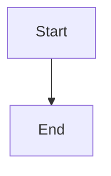
````

## Diagram Configuration via Frontmatter

Some Markdown viewers support Mermaid frontmatter for configuration:

````markdown
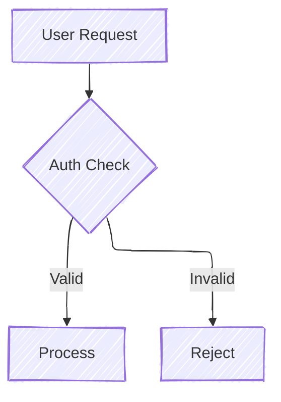
````

**Note:** Frontmatter support varies by viewer. GitHub renders diagrams with default settings; VS Code with Mermaid extension supports more options.

## Diagram Types

### Flowchart (graph)

Direction options: `TD` (top-down), `LR` (left-right), `BT` (bottom-top), `RL` (right-left).

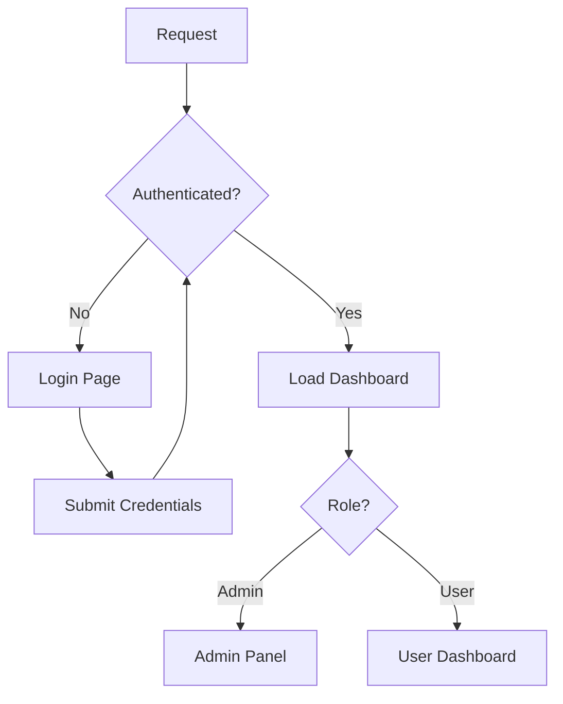

**Node shapes:**
| Syntax | Shape | Usage |
|--------|-------|-------|
| `[text]` | Rectangle | Default, general purpose |
| `(text)` | Rounded rectangle | Soft actions |
| `{text}` | Diamond | Decision points |
| `([text])` | Stadium | Start/end points |
| `[[text]]` | Subroutine | External processes |
| `[(text)]` | Cylinder | Database/storage |
| `((text))` | Circle | Connectors |
| `>text]` | Flag | Async signals |
| `{{text}}` | Hexagon | Preparation steps |

**Edge styles:**
| Syntax | Style | Usage |
|--------|-------|-------|
| `-->` | Arrow | Default flow |
| `---` | Line | Connection without direction |
| `-.->` | Dotted arrow | Optional/async flow |
| `==>` | Thick arrow | Primary/important flow |
| `--text-->` | Arrow with label | Labeled connection |
| `-->\|text\|` | Arrow with label (alt) | Labeled connection |

### Sequence Diagram

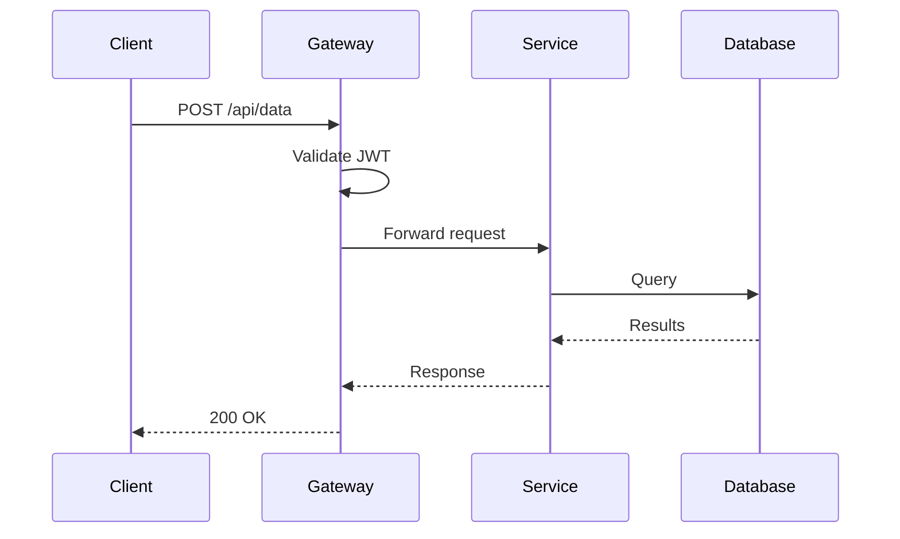

**Arrow types:**
| Syntax | Style |
|--------|-------|
| `->>` | Solid arrow (sync call) |
| `-->>` | Dashed arrow (async response) |
| `-x` | Solid with X (failed call) |
| `--x` | Dashed with X (failed response) |
| `-)` | Solid arrow (open end) |
| `--)` | Dashed arrow (open end) |

**Activation and notes:**
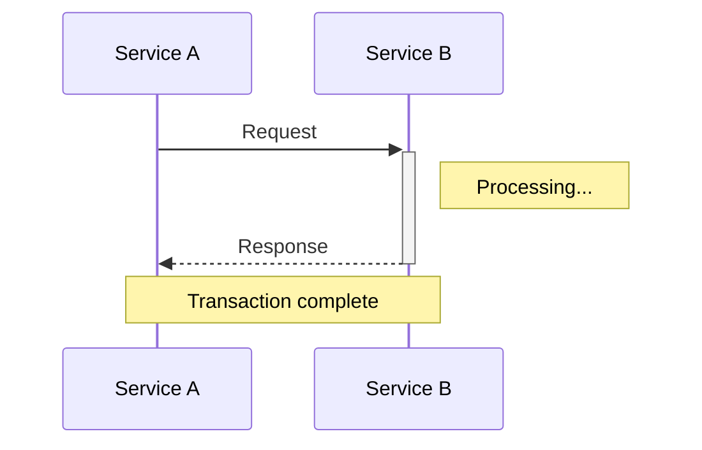

### State Diagram

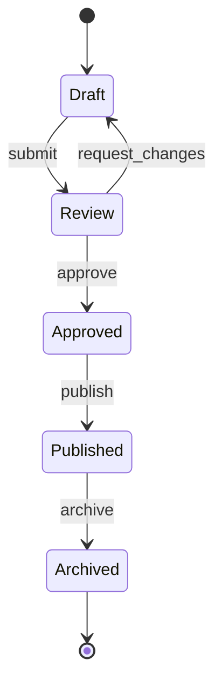

**⚠️ Label limitations:** State diagram transition labels have a strict parser. Avoid:
- `<br/>` — only works in flowcharts; causes parse errors in state diagrams
- Parentheses in labels — `cancel()` can confuse the parser
- Multiple colons — the first `:` is the label delimiter; extra colons may break parsing
- HTML entities — not supported

**Workaround:** If you need multi-line labels or special characters, use `flowchart` instead with quoted labels:
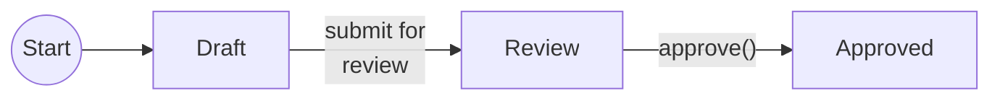

### ER Diagram

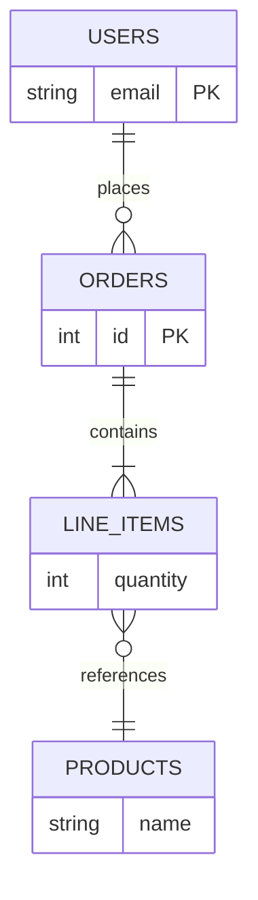

**Cardinality markers:**
| Syntax | Meaning |
|--------|---------|
| `\|\|` | Exactly one |
| `o\|` | Zero or one |
| `}\|` | One or more |
| `o{` | Zero or more |

### Mind Map

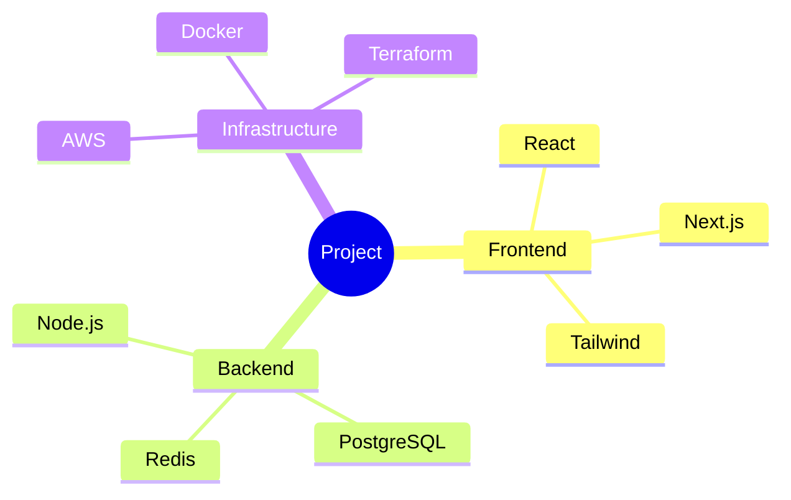

### Class Diagram

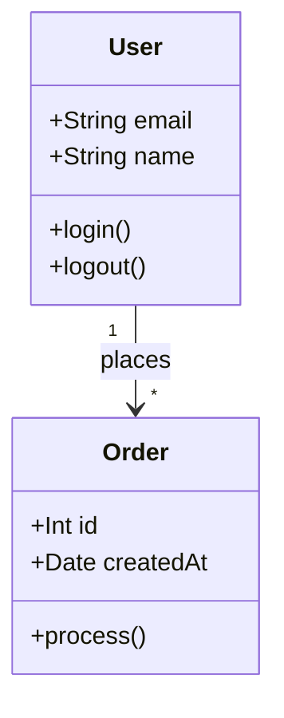

**Visibility markers:**
| Symbol | Visibility |
|--------|------------|
| `+` | Public |
| `-` | Private |
| `#` | Protected |
| `~` | Package |

### Pie Chart

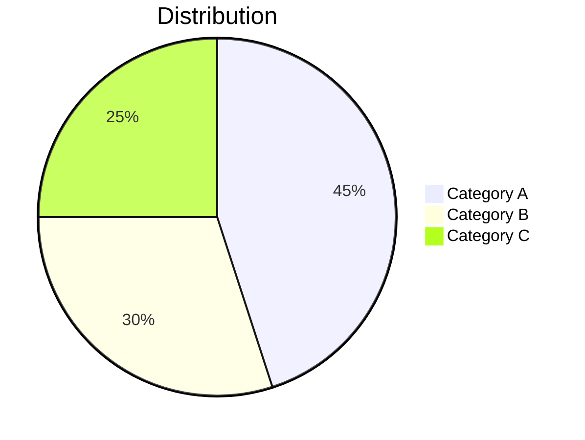

### Gantt Chart

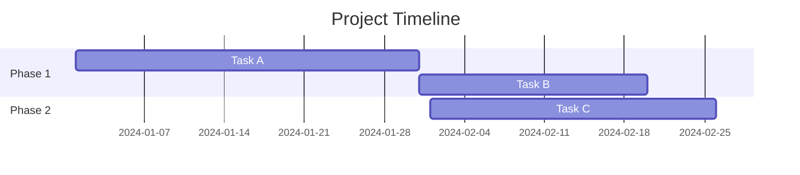

## Styling with classDef

Define custom styles for nodes within the diagram:

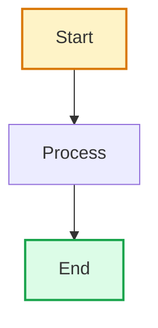

### classDef Gotchas

**1. Never set `color:` in classDef for cross-theme compatibility.**

classDef values are static — they can't use CSS variables or adapt to light/dark mode. If you set `color:#000000`, it will be unreadable in dark mode. Let the Markdown viewer handle text color automatically.

**2. Use semi-transparent fills (8-digit hex with alpha).**

Opaque fills like `fill:#fefce8` render as bright boxes in dark mode. Use alpha values for fills that work in both themes:

```
classDef highlight fill:#d9770633,stroke:#d97706,stroke-width:2px
classDef muted fill:#7c6f6422,stroke:#7c6f6488,stroke-width:1px
```

Alpha values: `11`-`33` for subtle, `44`-`77` for prominent.

**3. Border colors are more reliable than fills.**

If you want nodes to stand out across themes, use distinctive `stroke` colors rather than `fill`:

```
classDef important stroke:#dc2626,stroke-width:3px
```

## Subgraphs

Group related nodes:

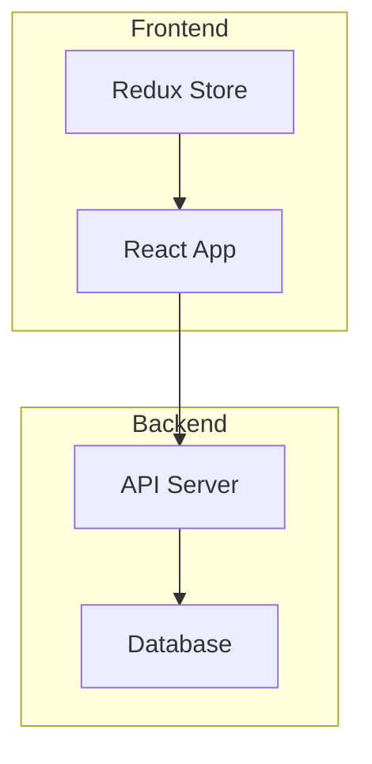

Subgraphs can be nested and styled:
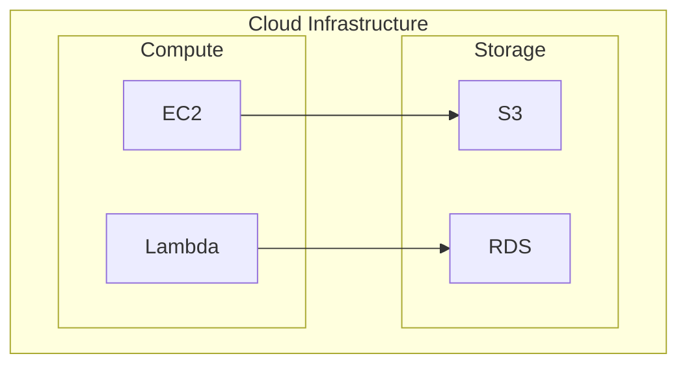

## Notes

Add notes to sequence diagrams:

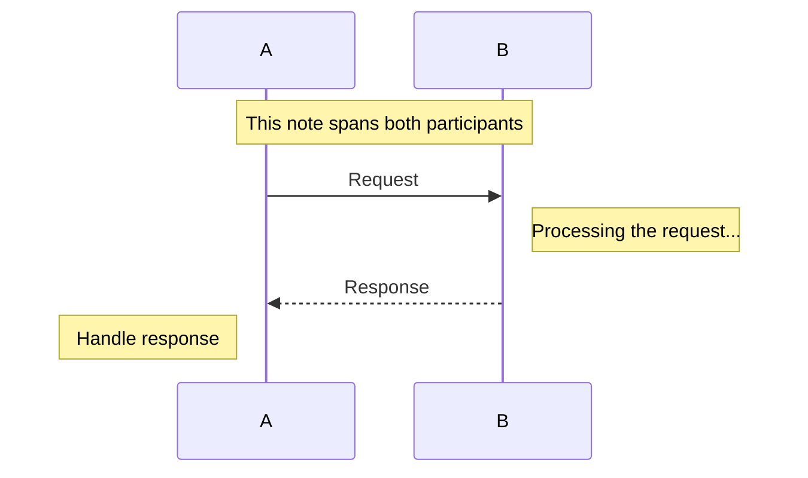

## Links in Nodes

Add clickable links (supported in some viewers):

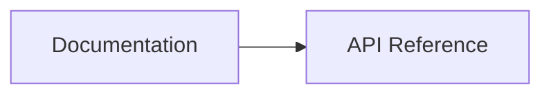

**Note:** Link support varies by Markdown viewer. GitHub does not render clickable links in Mermaid diagrams for security reasons.

## Tips for Markdown Output

1. **Keep diagrams focused** — Complex diagrams with 30+ nodes become hard to read. Break into multiple smaller diagrams.

2. **Use clear, short labels** — Long labels cause layout issues. Use abbreviations and provide a legend table below the diagram.

3. **Test rendering** — Check how diagrams appear in your target viewer (GitHub, VS Code, etc.). Some features render differently.

4. **Provide text fallback** — For critical information, include a text summary alongside the diagram for accessibility and search.

5. **Avoid special characters in labels** — Quotes, brackets, and angle brackets can break parsing. Use simple alphanumeric labels.

6. **Direction matters** — `TD` (top-down) works best for hierarchies and flows. `LR` (left-right) works best for timelines and pipelines.

7. **Color for meaning, not decoration** — Use classDef sparingly to highlight important nodes, not to make diagrams "pretty."
