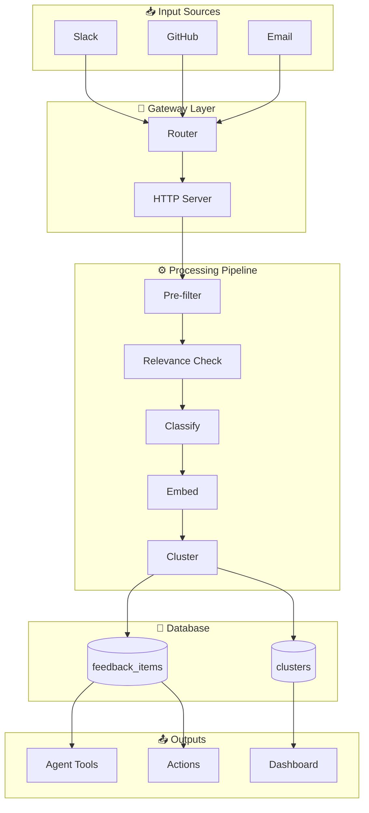
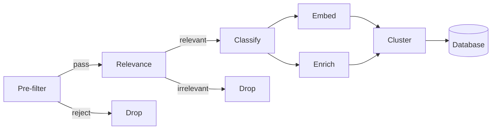

# System Architecture

Reference template for architecture diagrams in Markdown format. Demonstrates:
- Section organization with clear hierarchy
- Mermaid diagrams for system topology
- Tables for component details
- Collapsible sections for secondary information
- Status indicators and legends

---

## 📊 Overview

| Metric | Value |
|--------|-------|
| Total Components | **8** |
| Data Flows | **5** |
| External Integrations | **3** |
| Database Tables | **2** |

---

## Input Sources

External systems that feed data into the pipeline:

| Source | Protocol | Description |
|--------|----------|-------------|
| Slack | Webhooks | Team communication events |
| GitHub | REST API | Repository webhooks, PR events |
| Email | IMAP/SMTP | Customer feedback processing |

---

## System Diagram

---

## Gateway Layer

Entry point for all incoming events.

| Component | File | Description |
|-----------|------|-------------|
| **Router** | `src/gateway/router.ts` | Routes messages to agents via `resolveRoute()` |
| **HTTP Server** | `src/gateway/server.ts` | Plugin routes + handlers for webhooks and API |

### Key Functions

- `resolveRoute(message)` — Determines target agent based on message content
- `handleWebhook(req, res)` — Processes incoming webhook payloads
- `validateSignature(payload, sig)` — Verifies webhook authenticity

---

## Processing Pipeline

Sequential processing stages with different computational requirements.

### Pipeline Stages

| Step | Name | Type | Description |
|------|------|------|-------------|
| 0 | Pre-filter | No LLM | Allowlist check, bot detection, dedup |
| 1 | Relevance | LLM | Cheap boolean check for relevance |
| 2 | Classify | LLM | JSON schema validated classification |
| 3 | Embed | Embedding | Vector embedding generation |
| 4 | Enrich | No LLM | User resolution, metadata enrichment |
| 5 | Cluster | DB Write | Cosine similarity matching + INSERT |

### Legend

| Type | Meaning |
|------|---------|
| No LLM | Pure computation, no AI calls |
| LLM | Requires language model inference |
| Embedding | Vector embedding model call |
| DB Write | Database write operation |

---

## Database Schema

📁 Table Definitions

### feedback_items

| Column | Type | Description |
|--------|------|-------------|
| `id` | UUID | Primary key |
| `source` | ENUM | Origin (slack, github, email) |
| `content` | TEXT | Raw message content |
| `classification` | JSONB | Structured classification |
| `embedding` | VECTOR(1536) | OpenAI embedding |
| `cluster_id` | UUID | FK to clusters |
| `created_at` | TIMESTAMP | Ingestion time |

### clusters

| Column | Type | Description |
|--------|------|-------------|
| `id` | UUID | Primary key |
| `centroid` | VECTOR(1536) | Cluster center |
| `item_count` | INT | Number of items |
| `trend` | ENUM | rising, stable, falling |
| `severity` | ENUM | low, medium, high, critical |
| `ticket_url` | TEXT | Linked ticket if any |

---

## Outputs

### Agent Tools

Tools available for agent interaction:

- `search(query, options)` — Semantic vector search across feedback items
- `clusters(filters)` — Browse and filter clusters by severity, trend, date
- `stats(timeRange)` — Aggregate metrics and summary statistics

### Actions

Automated actions triggered by the system:

- Create tickets from clusters when severity >= high
- Notify customers on feature ship (linked to closed tickets)
- Generate release notes from resolved clusters

### Dashboard

Web interface providing:

- Real-time metrics overview
- Live feedback stream
- Natural language chat interface for queries

---

## Configuration

⚙️ Environment Variables

| Variable | Required | Description |
|----------|----------|-------------|
| `DATABASE_URL` | ✅ | PostgreSQL connection string |
| `OPENAI_API_KEY` | ✅ | OpenAI API key for embeddings |
| `SLACK_WEBHOOK_SECRET` | ✅ | Slack signature verification |
| `GITHUB_APP_SECRET` | ✅ | GitHub webhook secret |
| `LOG_LEVEL` | ❌ | Logging verbosity (default: info) |

---

> **Multi-tenant Architecture** — Each agent gets an isolated database at `{agentDir}/intelligence/feedback.db` with per-agent config overlay and credential isolation. Data never crosses agent boundaries.
