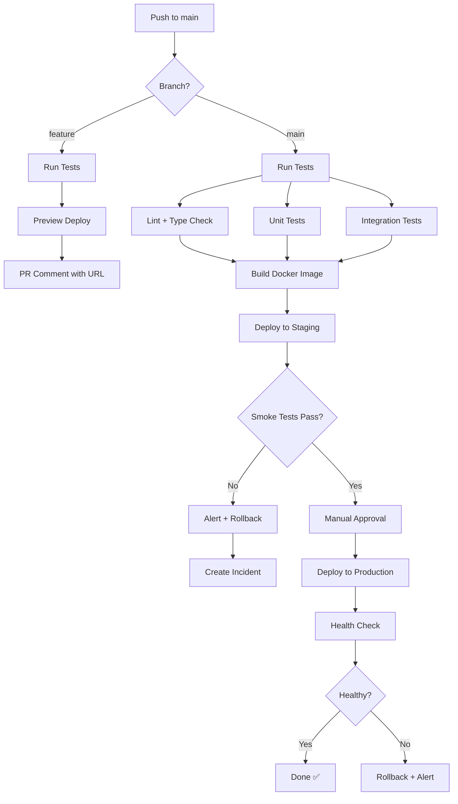
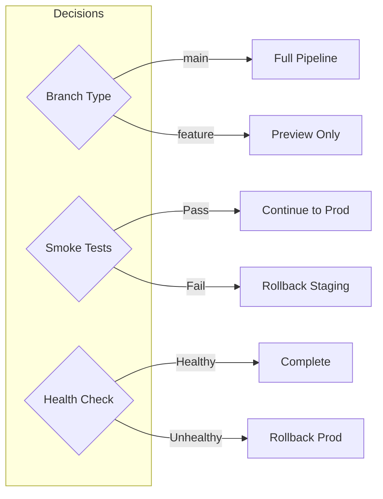

# CI/CD Pipeline

Reference template for Mermaid flowchart diagrams in Markdown format. Demonstrates:
- Complex flowcharts with decision points
- Parallel branches and merge points
- Stage details in tables
- Legend for diagram symbols
- Collapsible supplementary information

---

## 📊 Pipeline Overview

| Metric | Value |
|--------|-------|
| Total Stages | **12** |
| Decision Points | **3** |
| Parallel Steps | **3** (tests run concurrently) |
| Manual Gates | **1** (production approval) |

---

## Overview

Every push to `main` triggers the full pipeline. Tests and linting run in parallel, then the build step produces a Docker image. Staging deploys automatically; production requires manual approval via a GitHub environment gate.

---

## Pipeline Flow



---

## Stage Details

### Pre-Build Stages

| Stage | Trigger | Duration | Failure Action |
|-------|---------|----------|----------------|
| **Lint + Type Check** | Push to any branch | ~30s | Block build |
| **Unit Tests** | Push to any branch | ~2min | Block build |
| **Integration Tests** | Push to any branch | ~5min | Block build |

### Build & Deploy Stages

| Stage | Trigger | Duration | Failure Action |
|-------|---------|----------|----------------|
| **Build Docker Image** | All tests pass | ~3min | Block deployment |
| **Deploy to Staging** | Build success | ~2min | Alert team |
| **Smoke Tests** | Staging deployed | ~1min | Rollback staging |

### Production Stages

| Stage | Trigger | Duration | Failure Action |
|-------|---------|----------|----------------|
| **Manual Approval** | Smoke tests pass | Manual | N/A |
| **Deploy to Production** | Approval granted | ~3min | Alert + rollback |
| **Health Check** | Deploy complete | ~30s | Rollback |

---

## Decision Points



| Decision | Condition | Pass Action | Fail Action |
|----------|-----------|-------------|-------------|
| Branch Type | `github.ref == 'refs/heads/main'` | Full pipeline | Preview deploy only |
| Smoke Tests | All endpoints return 200 | Manual approval gate | Auto rollback + alert |
| Health Check | `/health` returns OK within 30s | Mark successful | Auto rollback + incident |

---

## Legend

| Symbol | Meaning |
|--------|---------|
| Rectangle `[text]` | Automated step |
| Diamond `{text}` | Decision point / gate |
| Arrow `-->` | Sequential dependency |
| Arrow with label `--\|text\|-->` | Conditional path |
| Dashed arrow `-.->` | Optional / async path |

---

## Environment Configuration

<details>
<summary>🔧 GitHub Actions Workflow</summary>

```yaml
name: CI/CD Pipeline

on:
  push:
    branches: [main, 'feature/**']
  pull_request:
    branches: [main]

jobs:
  test:
    runs-on: ubuntu-latest
    steps:
      - uses: actions/checkout@v4
      - name: Run tests
        run: npm test

  build:
    needs: test
    runs-on: ubuntu-latest
    steps:
      - name: Build Docker image
        run: docker build -t app:${{ github.sha }} .

  deploy-staging:
    needs: build
    runs-on: ubuntu-latest
    environment: staging
    steps:
      - name: Deploy to staging
        run: ./deploy.sh staging

  deploy-production:
    needs: deploy-staging
    runs-on: ubuntu-latest
    environment: production
    steps:
      - name: Deploy to production
        run: ./deploy.sh production
```

</details>

---

## Rollback Procedure

<details>
<summary>🔙 Manual Rollback Steps</summary>

1. **Identify the last known good version**
   ```bash
   git log --oneline -10
   ```

2. **Trigger rollback deployment**
   ```bash
   gh workflow run rollback.yml -f version=<sha>
   ```

3. **Verify rollback success**
   ```bash
   curl https://app.example.com/health
   ```

4. **Create incident report**
   - Document what failed
   - Timeline of events
   - Root cause (if known)

</details>

---

> **Note:** This template demonstrates Mermaid flowchart syntax with decision diamonds, parallel paths, and labeled edges. The diagram renders natively in GitHub, GitLab, and VS Code.
